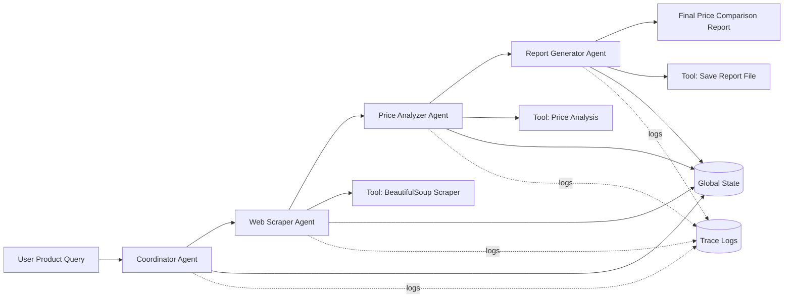

# Smart Price Comparison MAS Workflow Diagram

```mermaid
flowchart LR
    U[User Product Query] --> C[Coordinator Agent]
    C --> WS[Web Scraper Agent]
    WS --> PA[Price Analyzer Agent]
    PA --> RG[Report Generator Agent]
    RG --> O[Final Price Comparison Report]

    WS --> T1[Tool: BeautifulSoup Scraper]
    PA --> T2[Tool: Price Analysis]
    RG --> T3[Tool: Save Report File]

    C --> G[(Global State)]
    WS --> G
    PA --> G
    RG --> G

    C -.logs.-> L[(Trace Logs)]
    WS -.logs.-> L
    PA -.logs.-> L
    RG -.logs.-> L
```
