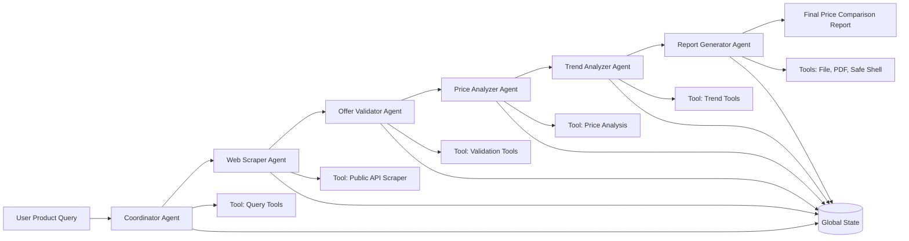

# AI-Based Smart Price Comparison Multi-Agent System (MAS)

## Module
SE4010 - Current Trends in Software Engineering - Assignment 2

## Group Information
- Group: Y4S2-SE-WE
- Group ID: 56

| Student ID | Name | Email |
|---|---|---|
| IT22125248 | Annesiyani Srikanthan | it22125248@my.sliit.lk |
| IT22099518 | Hemapriya H. A . N. S | it22099518@my.sliit.lk |
| IT22167378 | H.I.G.Amith Hasintha | it22167378@my.sliit.lk |
| IT22083296 | E.K.K.Tharushi Nethmini Edirisinghe | it22083296@my.sliit.lk |

## 1. Introduction and Problem Domain
Price comparison is a frequent requirement in e-commerce and grocery purchasing. Users typically visit multiple sources, inspect product variations, compare prices manually, and then estimate the most suitable option. This process is repetitive, slow, and prone to errors, especially when product names and units vary across stores.

This project introduces a locally hosted Multi-Agent System (MAS) that automates the full workflow from user request to final report generation. Instead of using one generic chatbot, the system uses a coordinated set of specialized agents for request understanding, collection, validation, analysis, trend comparison, and reporting.

The solution satisfies assignment constraints:
- Local execution on student machines.
- No paid cloud API dependency.
- LangGraph-based deterministic orchestration.
- Tool-backed agent actions.
- Traceable logs and run summaries.

### 1.1 Local-Only and Ollama Compliance
- Inference runs locally through Ollama (default model: llama3:8b).
- No paid cloud LLM keys are required.
- Fully offline deterministic mode is supported via MAS_OFFLINE_MODE=1.
- Reports, traces, and summaries are generated and stored locally.

## 2. System Architecture
The architecture is implemented as a deterministic six-agent pipeline:
1. Coordinator Agent
2. Web Scraper Agent
3. Offer Validator Agent
4. Price Analyzer Agent
5. Trend Analyzer Agent
6. Report Generator Agent

### 2.1 Architectural Rationale
A multi-agent architecture was selected because each stage needs different capabilities:
- Request understanding and normalization.
- Data acquisition and extraction.
- Data quality validation and de-duplication.
- Numerical/statistical reasoning.
- Historical trend reasoning.
- User-facing synthesis and persistence.

This role separation improves modularity, testability, and maintainability compared with a single-agent design.

### 2.2 Workflow Diagram

### 2.3 Orchestration Implementation
The workflow in LangGraph uses explicit state transitions:
- START -> coordinator
- coordinator -> web_scraper
- web_scraper -> offer_validator
- offer_validator -> price_analyzer
- price_analyzer -> trend_analyzer
- trend_analyzer -> report_generator
- report_generator -> END

This explicit path ensures predictable behavior and avoids hidden control flow.

## 3. Multi-Agent Design
All system prompts are maintained in a centralized prompt module for consistency and maintainability.

### 3.1 Coordinator Agent
Role: Initializes workflow state from user request.

Responsibilities:
- Parse and validate user request.
- Extract product intent.
- Produce normalized query and source plan.

Output highlights:
- product_name
- normalized_product_query
- source_urls

### 3.2 Web Scraper Agent
Role: Collects candidate offers from offline/online sources.

Responsibilities:
- Retrieve source content.
- Extract store/title/price/currency records.
- Normalize and filter malformed entries.

Output highlights:
- scraped_items
- research_notes

### 3.3 Offer Validator Agent
Role: Cleans and categorizes collected offers before analysis.

Responsibilities:
- Remove invalid prices and malformed entries.
- Remove duplicates.
- Categorize offers into Budget / Standard / Premium.
- Compute quality score and validation notes.

Output highlights:
- validated_items
- price_quality_score
- offer_categories
- offer_risk_notes

### 3.4 Price Analyzer Agent
Role: Computes best-offer statistics from validated data.

Responsibilities:
- Validate numeric consistency.
- Compute best_price, best_store, min, max, average.
- Produce concise analysis summary.

Output highlights:
- best_store
- best_price
- min_price
- max_price
- average_price
- analysis_summary

### 3.5 Trend Analyzer Agent
Role: Compares current best price with historical dataset prices.

Responsibilities:
- Calculate trend direction and percentage change.
- Compute historical average and sample count.
- Produce recommendation based on trend.

Output highlights:
- trend_direction
- trend_change
- trend_summary
- trend_recommendation
- trend_history_average
- trend_history_count

### 3.6 Report Generator Agent
Role: Generates final user-facing outputs and persists artifacts.

Responsibilities:
- Generate structured markdown report.
- Save markdown and PDF report files.
- Preserve traceability and run metadata.

Output highlights:
- final_report
- saved_report_path
- saved_report_pdf_path
- report_notes

### 3.7 Interaction Strategy
Sequential shared-state delegation is used:
1. Coordinator writes normalized request fields.
2. Web Scraper appends scraped_items.
3. Offer Validator creates validated_items and quality metadata.
4. Price Analyzer computes statistical outputs.
5. Trend Analyzer enriches state with historical insight.
6. Report Generator produces and saves final artifacts.

This keeps responsibilities isolated and each agent independently testable.

### 3.8 What the 6 Agents Do During a Run
For input such as "Compare prices for coconut":

1. Coordinator Agent
- Extracts product_name from user_request.
- Normalizes query for downstream tools.

2. Web Scraper Agent
- Collects candidate offers for the target product.
- Filters malformed/non-positive raw values.

3. Offer Validator Agent
- Removes invalid and duplicate offers.
- Adds offer categories and validation quality score.

4. Price Analyzer Agent
- Computes best price/store and summary statistics.
- Ensures best_price is within [min_price, max_price].

5. Trend Analyzer Agent
- Compares best_price with historical prices.
- Returns trend direction, change percentage, and recommendation.

6. Report Generator Agent
- Combines all outputs into final markdown and PDF reports.
- Returns saved paths and report notes.

## 4. Custom Tools and Integration
Each agent uses dedicated tools to ensure environment-grounded behavior.

### 4.1 Integration Flow Across Tools
Tool calls are integrated as a strict chain aligned with agent responsibilities:
1. Coordinator Agent uses local query normalization utilities in [src/mas/tools/query_tools.py](src/mas/tools/query_tools.py).
2. Web Scraper Agent invokes scraping and parsing utilities in [src/mas/tools/public_api.py](src/mas/tools/public_api.py) to build scraped_items.
3. Offer Validator Agent invokes validation utilities in [src/mas/tools/offer_validator_tools.py](src/mas/tools/offer_validator_tools.py) to clean, deduplicate, and categorize offers.
4. Price Analyzer Agent invokes numerical analysis utilities in [src/mas/tools/price_tools.py](src/mas/tools/price_tools.py) to compute statistics.
5. Trend Analyzer Agent invokes historical comparison utilities in [src/mas/tools/trend_tools.py](src/mas/tools/trend_tools.py) to compare the current best price with historical data.
6. Report Generator Agent invokes file, PDF, and safe shell utilities in [src/mas/tools/file_tools.py](src/mas/tools/file_tools.py), [src/mas/tools/pdf_tools.py](src/mas/tools/pdf_tools.py), and [src/mas/tools/shell_tools.py](src/mas/tools/shell_tools.py) for final artifacts.

This explicit mapping ensures each agent uses at least one concrete tool and avoids a purely prompt-only implementation.

### 4.2 Coordinator Query Tool
File: src/mas/tools/query_tools.py

Key functions:
- extract_product_name(...)
- normalize_product_query(...)

Purpose:
- Product extraction and normalization for deterministic downstream matching.

### 4.3 Web Scraping Tool
File: src/mas/tools/public_api.py

Key functions:
- extract_prices_from_html(...)
- scrape_prices(...)

Purpose:
- Fetch and parse product offers from source content into normalized records.

### 4.4 Offer Validation Tool
File: [src/mas/tools/offer_validator_tools.py](src/mas/tools/offer_validator_tools.py)

Function:
- validate_price_offers(...)

Functionality:
- Remove invalid and duplicate offers.
- Categorize offers into Budget, Standard, and Premium tiers.
- Compute quality score and validation notes.

### 4.5 Price Analysis Tool
File: [src/mas/tools/price_tools.py](src/mas/tools/price_tools.py)

Function:
- analyze_prices(items)

Functionality:
- Filter invalid numeric values.
- Compute best, minimum, maximum, and average prices.
- Return deterministic analysis outputs.

### 4.6 Trend Analysis Tool
File: [src/mas/tools/trend_tools.py](src/mas/tools/trend_tools.py)

Function:
- compute_price_trend(...)

Functionality:
- Compare the current best price with historical prices.
- Return trend direction, percentage change, summary, and recommendation.

### 4.7 File, PDF, and Safe Shell Tools
Files:
- src/mas/tools/file_tools.py
- src/mas/tools/pdf_tools.py
- src/mas/tools/shell_tools.py

Purpose:
- Persist reports, generate PDFs, and collect safe runtime metadata via command allowlist.

## 5. State Management
Shared context is preserved through MASState.

Representative fields:
- trace_id, model, user_request
- product_name, normalized_product_query, source_urls
- scraped_items, product_available, research_notes
- validated_items, price_quality_score, offer_categories, offer_risk_notes
- best_store, best_price, min_price, max_price, average_price, analysis_summary
- trend_direction, trend_change, trend_summary, trend_recommendation
- trend_history_average, trend_history_count
- final_report, saved_report_path, saved_report_pdf_path, report_notes

Handoff strategy:
- Each agent writes only owned fields.
- Downstream agents read prior fields from the same state object.
- Explicit graph edges prevent stage skipping.

## 6. Orchestration, Observability, and Evaluation

### 6.1 Orchestration Framework
LangGraph provides deterministic execution with explicit route:

coordinator -> web_scraper -> offer_validator -> price_analyzer -> trend_analyzer -> report_generator

### 6.2 Observability and Logging
Tracked event types:
- run_start
- tool_call
- agent_output
- run_end

Generated artifacts:
- logs/trace_<trace_id>.jsonl
- logs/summary_<trace_id>.json

### 6.3 Testing and Evaluation
Validation layers:
1. Tool-level unit tests.
2. Agent behavior tests.
3. Graph smoke tests.
4. Evaluation harness in evaluation.py.

Evaluation scenarios:
- Compare prices for coconut
- Compare prices for rice
- Find best deal for milk powder
- Injection-like request safety check

Core quality assertions:
- Product extraction is present.
- Scraped dataset exists.
- Validation quality and categories are produced.
- Best price is positive and within [min_price, max_price].
- Trend output includes direction and recommendation.
- Report markdown and PDF paths are saved.
- Unsafe shell/injection commands are blocked.

Edge/security tests now include:
- Coordinator: spacing/case normalization.
- Web Scraper: unknown product fallback.
- Offer Validator: invalid/duplicate offer filtering.
- Price Analyzer: all-invalid-prices handling.
- Trend Analyzer: zero-price and no-history handling.
- Report Generator: safe shell failure resilience.

## 7. Individual Contributions

| Student ID | Name | Primary Agent | Tool Ownership | Testing Ownership | Additional Shared Work |
|---|---|---|---|---|---|
| IT22125248 | Annesiyani Srikanthan | Coordinator Agent | src/mas/tools/query_tools.py | tests/test_coordinator_agent.py | Integration support for new-agent workflow |
| IT22099518 | Hemapriya H. A . N. S | Web Scraper Agent | src/mas/tools/public_api.py | tests/test_web_scraper_agent.py | Data preparation support for validator and trend stages |
| IT22167378 | H.I.G.Amith Hasintha | Price Analyzer Agent | src/mas/tools/price_tools.py | tests/test_price_analyzer_agent.py | Offer Validator logic/tests contributions |
| IT22083296 | E.K.K.Tharushi Nethmini Edirisinghe | Report Generator Agent | src/mas/tools/file_tools.py, src/mas/tools/pdf_tools.py, src/mas/tools/shell_tools.py | tests/test_report_generator_agent.py | Trend Analyzer and evaluation-rule updates |

Contribution evidence is maintained in CONTRIBUTIONS.md and docs/contributions/.

## 8. Links

### 8.1 GitHub Link
https://github.com/Tharushi-Nethmini/MAS

### 8.2 Video Link
Add final demo URL here.

## 9. Conclusion
The updated MAS now includes six coordinated agents with explicit support for offer validation and historical trend analysis. This improves data quality, analysis reliability, and decision value in the final report while preserving deterministic local-only execution, tool-backed behavior, and full traceability.
