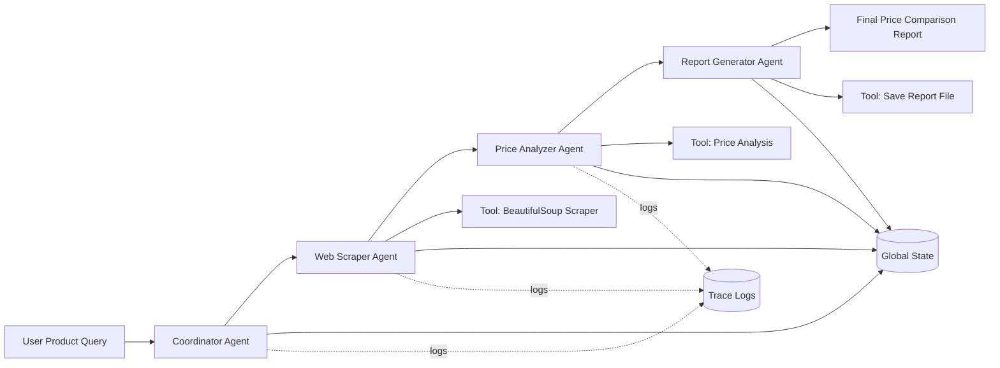

# AI-Based Smart Price Comparison Multi-Agent System (MAS)

## Module
SE4010 - CTSE Assignment 2 (Machine Learning)

## Group Information
- Group: Y4S2-SE-WE
- Group ID: 56

| Student ID | Name | Email |
|---|---|---|
| IT22125248 | Annesiyani Srikanthan | it22125248@my.sliit.lk |
| IT22099518 | Hemapriya H. A . N. S | it22099518@my.sliit.lk |
| IT22167378 | H.I.G.Amith Hasintha | it22167378@my.sliit.lk |
| IT22083296 | E.K.K.Tharushi Nethmini Edirisinghe | it22083296@my.sliit.lk |

## Team
Team Size: 4 Students

## 1. Introduction and Problem Domain
Price comparison is a daily task in e-commerce and grocery purchasing. Users often open multiple websites, search for the same product, manually compare listings, and then estimate the best option. This process is repetitive and may lead to poor decisions when users miss cheaper options, misread product variants, or fail to compare all available sources.

This project introduces a locally hosted Multi-Agent System (MAS) that automates this full workflow. Instead of one generic chatbot, the system uses a specialized team of agents, each handling one stage of the task. The system accepts a natural language request such as "Compare prices for coconut," gathers relevant price data, computes statistical insights, and generates a final report for users.

The solution is designed to satisfy assignment constraints:
- Local execution on student machines.
- Zero paid API dependency.
- Open-source orchestration using LangGraph.
- Agent tooling for environment interaction.
- Traceability through structured observability.

### 1.1 Local-Only and Ollama Compliance
- LLM inference is executed locally through Ollama (default model: `llama3:8b`).
- No paid cloud LLM API keys are required for execution.
- The system supports fully offline deterministic mode (`MAS_OFFLINE_MODE=1`) for reproducible demos and tests.
- All outputs (reports, traces, summaries) are generated and stored on local disk.

## 2. System Architecture
The MAS architecture is implemented as a deterministic four-stage pipeline:
1. Coordinator Agent
2. Web Scraper Agent
3. Price Analyzer Agent
4. Report Generator Agent

### 2.1 Architectural Rationale
A multi-agent architecture was selected because each stage requires different capabilities:
- Request understanding and routing.
- Data acquisition and normalization.
- Numerical/statistical reasoning.
- User-facing result synthesis and persistence.

Separating these roles makes the system easier to test, debug, and extend than a monolithic single-agent design.

### 2.2 Workflow Diagram



### 2.3 Orchestration Implementation
The workflow is implemented in LangGraph using a state graph with explicit edges:
- START -> coordinator
- coordinator -> web_scraper
- web_scraper -> price_analyzer
- price_analyzer -> report_generator
- report_generator -> END

This sequence ensures predictable transitions and avoids hidden control flow.

## 3. Multi-Agent Design
All system prompts are centralized in a dedicated prompt module to improve maintainability and visibility.

### 3.1 Coordinator Agent
Role: Orchestrates workflow and initializes shared state.

Responsibilities:
- Parse user request.
- Extract product intent.
- Prepare normalized product query and source list.
- Trigger downstream processing sequence.

System Prompt:
"You are a Coordinator Agent for a smart price comparison MAS. Your job is to extract the product name from the user request and prepare structured input for downstream agents. Rules: Always return structured fields only. Do not include unnecessary text. If product is unclear, default to keyword extraction."

Constraints and Reasoning Strategy:
- Keep output schema-driven.
- Avoid verbose text to reduce downstream parsing errors.
- Use fallback keyword extraction when intent ambiguity is high.

### 3.2 Web Scraper Agent
Role: Collects and normalizes candidate price entries.

Responsibilities:
- Fetch offline or online source content.
- Parse text/HTML for price patterns.
- Return normalized records (store, title, price, currency).

System Prompt:
"You are a Web Scraper Agent. Your job is to collect product price entries relevant to the given product name. Rules: Extract only valid positive numeric prices. Return normalized fields: store, title, price, currency. Ignore irrelevant content and malformed values."

Constraints and Reasoning Strategy:
- Reject malformed and non-positive prices.
- Apply deterministic normalization to improve reproducibility.
- Operate in offline-safe mode for demo stability.

### 3.3 Price Analyzer Agent
Role: Performs statistical analysis and best-offer detection.

Responsibilities:
- Validate numeric records.
- Calculate minimum, maximum, and average.
- Determine best store and best price.
- Produce concise analysis summary text.

System Prompt:
"You are a Price Analyzer Agent. Your job is to compute best offer and summary statistics from scraped prices. Rules: Compute min, max, average, best price, and best store. Validate numeric consistency before output. Return concise analysis summary text."

Constraints and Reasoning Strategy:
- Analyze only validated numeric entries.
- Enforce consistency checks (best within min-max bounds).
- Raise controlled errors for empty valid sets.

### 3.4 Report Generator Agent
Role: Converts accumulated state into final user artifacts.

Responsibilities:
- Format final analysis in markdown.
- Save output to local files.
- Preserve trace metadata and summary details.

System Prompt:
"You are a Report Generator Agent. Your job is to generate the final price comparison report from shared state. Rules: Include user request, scraped entries, and analysis outputs. Save report path and preserve traceability details. Keep output concise and professional."

Constraints and Reasoning Strategy:
- Preserve provenance by including trace identifiers.
- Avoid omission of computed fields.
- Produce consistent output format for automated checks.

### 3.5 Interaction Strategy
The interaction strategy is sequential delegation through shared state:
1. Coordinator writes request-derived fields.
2. Web Scraper appends scraped_items.
3. Price Analyzer enriches state with computed statistics.
4. Report Generator creates final_report and persistence metadata.

This pattern minimizes role overlap and keeps each component independently testable.

### 3.6 What the 4 Agents Actually Do During a Run
For an input such as "Compare prices for coconut", the runtime behavior is:

1. Coordinator Agent
- Reads user_request from state.
- Extracts product_name with regex and fallback logic.
- Normalizes query into normalized_product_query for downstream tools.
- Preserves source_urls and passes handoff state.

2. Web Scraper Agent
- Reads normalized_product_query and source_urls.
- Calls scraping tool to collect product entries from offline profile or web sources.
- Filters malformed/non-positive prices and returns normalized records in scraped_items.
- Writes research_notes summary of collection outcome.

3. Price Analyzer Agent
- Reads scraped_items.
- Validates numeric price values and removes invalid entries.
- Computes best_store, best_price, min_price, max_price, average_price.
- Produces analysis_summary for user-facing interpretation.

4. Report Generator Agent
- Reads all finalized fields from shared state.
- Generates final_report markdown content.
- Saves markdown and PDF artifacts locally.
- Logs tool calls and returns saved_report_path and saved_report_pdf_path.

## 4. Custom Tools and Integration
The system uses custom Python tools to ensure agents interact with the environment rather than relying on model-only responses.

### 4.0 Integration Flow Across Tools
Tool calls are integrated as a strict chain aligned with agent responsibilities:

1. Coordinator Agent uses query extraction and normalization utilities from src/mas/tools/query_tools.py, with local LLM refinement as optional enhancement.
2. Web Scraper Agent invokes scraping/parsing utilities to build scraped_items.
3. Price Analyzer Agent invokes numerical analysis utility to compute statistics.
4. Report Generator Agent invokes file, PDF, and safe shell utilities for final artifacts.

This explicit mapping ensures each agent uses at least one concrete tool and avoids a purely prompt-only implementation.

### 4.1 Coordinator Query Tool
File: src/mas/tools/query_tools.py

Representative signatures:
```python
def extract_product_name(text: str) -> str
def normalize_product_query(product_name: str) -> str
```

Engineering decisions:
- Keeps request parsing logic modular and testable outside the agent file.
- Uses fallback behavior for empty or ambiguous requests.
- Produces normalized query text for consistent downstream scraping.

Example usage:
```python
product_name = extract_product_name("Compare prices for coconut")
normalized = normalize_product_query(product_name)
```

Integration point:
- Called by Coordinator Agent before optional local LLM refinement.

### 4.2 Web Scraping Tool
File: src/mas/tools/public_api.py

Representative signatures:
```python
def extract_prices_from_html(store_name: str, html: str, product_name: str) -> list[dict[str, Any]]
def scrape_prices(product_name: str, source_urls: list[str] | None = None, offline_mode: bool = False, model: str | None = None) -> list[dict[str, Any]]
```

Engineering decisions:
- Supports deterministic offline catalog generation for reproducible demos.
- Uses parser + regex extraction with validation.
- Supports Shopify endpoint extraction and optional snapshot mode.
- Returns a normalized schema consumed directly by the analyzer stage.

Example usage:
```python
items = scrape_prices(product_name="coconut", source_urls=[], offline_mode=True)
```

Integration point:
- Called by Web Scraper Agent to produce shared state field scraped_items.

### 4.3 Price Analysis Tool
File: src/mas/tools/price_tools.py

Representative signature:
```python
def analyze_prices(items: list[dict[str, Any]]) -> dict[str, Any]
```

Engineering decisions:
- Filters invalid records safely.
- Calculates best, min, max, average, sample size.
- Raises ValueError when no valid prices are available.
- Produces deterministic numeric outputs for report generation.

Example usage:
```python
summary = analyze_prices([
    {"store": "A", "price": 120.0},
    {"store": "B", "price": 110.0},
])
```

Integration point:
- Called by Price Analyzer Agent to fill best_price, best_store, min_price, max_price, and average_price.

### 4.4 File Interaction Tool
File: src/mas/tools/file_tools.py

Representative signatures:
```python
def save_markdown_file(path: str, content: str) -> str
def load_json_file(path: str) -> dict[str, Any]
```

Engineering decisions:
- Parent directories are created automatically.
- JSON loader validates root object type.
- Paths are returned in resolved form for traceability.
- Avoids path-related runtime failures during report persistence.

Example usage:
```python
saved_path = save_markdown_file("reports/example.md", "# Report")
```

Integration point:
- Called by Report Generator Agent to persist markdown report output.

### 4.5 PDF Generation Tool
File: src/mas/tools/pdf_tools.py

Representative signature:
```python
def save_report_pdf(path: str, title: str, body: str) -> str
```

Engineering decisions:
- Uses ReportLab to generate an A4-compatible report file.
- Keeps markdown and PDF contents aligned from the same report body.
- Returns saved path for downstream verification and testing.

Example usage:
```python
pdf_path = save_report_pdf("reports/example.pdf", "Price Report", report_text)
```

Integration point:
- Called by Report Generator Agent to produce submission-ready PDF output.

### 4.6 Secure Shell Tool
File: src/mas/tools/shell_tools.py

Representative signature:
```python
def run_safe_shell(command: str) -> str
```

Engineering decisions:
- Strict allowlist of read-only commands.
- Empty or non-allowlisted commands are blocked.
- Runtime failures raise explicit RuntimeError.
- Reduces command-injection risk while preserving environment observability.

Example usage:
```python
output = run_safe_shell("Get-Date")
```

Integration point:
- Called by Report Generator Agent for runtime snapshot metadata included in report notes.

## 5. State Management
Global context is preserved through a typed dictionary structure (MASState).

Representative fields:
- trace_id
- model
- user_request
- product_name
- normalized_product_query
- source_urls
- scraped_items
- analysis_summary
- best_price
- best_store
- min_price
- max_price
- average_price
- final_report
- saved_report_path
- saved_report_pdf_path

Example state snapshot:
```python
state = {
    "product_name": "coconut",
    "scraped_items": [
        {"store": "Glomark", "title": "Fresh Coconut", "price": 120.0, "currency": "LKR"},
        {"store": "Keells", "title": "Coconut", "price": 135.5, "currency": "LKR"},
        {"store": "Arpico", "title": "Coconut", "price": 110.0, "currency": "LKR"},
    ],
    "best_price": 110.0,
    "best_store": "Arpico",
    "min_price": 110.0,
    "max_price": 135.5,
    "average_price": 121.83,
}
```

Handoff strategy:
- Each agent updates only its owned fields.
- Downstream agents read required prior outputs from the same shared object.
- Deterministic graph edges prevent accidental context skips.

## 6. Observability and Logging (LLMOps/AgentOps)
The project includes structured observability for debugging and evidence.

### 6.1 Logging Functions
- log_event(trace_id, event_type, payload)
- write_run_summary(trace_id, summary)

### 6.2 Tracked Event Types
- run_start
- tool_call
- agent_output
- run_end

### 6.3 Output Artifacts
- logs/trace_<trace_id>.jsonl
- logs/summary_<trace_id>.json

Observability benefits:
- Reproducible debugging.
- Transparent tool and agent behavior.
- Clear viva and report evidence.

## 7. Evaluation Methodology, Testing, and Reliability Analysis
The project uses a layered testing strategy that combines unit tests, end-to-end checks, and a rule-based evaluation harness.

### 7.1 Unified Group Testing Harness
Shared harness components:
- tests/ directory for automated tests.
- evaluation.py for multi-scenario reliability checks.

Core evaluated scenarios:
- Compare prices for coconut
- Compare prices for rice
- Find best deal for milk powder

Core quality assertions:
- Product extraction is present.
- Scraped dataset is present.
- Analysis summary is generated.
- best_price is positive.
- best_price is between min and max.
- Unsafe shell commands are blocked.
- Report path is generated.

### 7.2 Student-Specific Test Contribution Requirement
Each student must contribute test cases and assertions validating their own agent outputs within the shared harness.

Recommended ownership split:
- Student 1: Coordinator extraction and normalization assertions.
- Student 2: Web scraping extraction, normalization, malformed content handling.
- Student 3: Statistical consistency, no-valid-price error behavior.
- Student 4: Report persistence, summary writing, end-to-end output completeness.

### 7.3 Reliability and Failure Analysis
Observed reliability strengths:
- Deterministic orchestration path reduces control-flow errors.
- Numeric validation prevents invalid analytical output.
- Offline mode supports stable demonstrations.
- Safe shell allowlist prevents risky command execution.

Known failure risks and mitigations:
- Source HTML variability can reduce extraction accuracy.
- Mitigation: robust parsing rules, normalization, and fallback profiles.
- Dynamic web structures may break selectors over time.
- Mitigation: snapshot and replay support for deterministic verification.

## 8. Individual Contributions (Proof Section)

Each student must provide concrete evidence with commit/PR links. The following table summarizes the agent, tool, and challenges for each student:

| Student ID | Name | Agent Developed | Tool Implemented | Challenges Faced | Evidence Links |
|---|---|---|---|---|---|
| IT22125248 | Annesiyani Srikanthan | Coordinator Agent | [query_tools.py](../src/mas/tools/query_tools.py) <br> (Query normalization helper) | Ambiguous product requests | [student_1.md](../docs/contributions/student_1.md); Commits: `ca43650`, `c940a18` |
| IT22099518 | Hemapriya H. A . N. S | Web Scraper Agent | [public_api.py](../src/mas/tools/public_api.py) <br> (scrape_prices, HTML extraction) | Inconsistent source structures | [student_2.md](../docs/contributions/student_2.md); Commits: `87f7a84`, `ca43650` |
| IT22167378 | H.I.G.Amith Hasintha | Price Analyzer Agent | [price_tools.py](../src/mas/tools/price_tools.py) <br> (analyze_prices) | Invalid numeric values in scraped records | [student_3.md](../docs/contributions/student_3.md); Commits: `c940a18`, `ca43650` |
| IT22083296 | E.K.K.Tharushi Nethmini Edirisinghe | Report Generator Agent | [file_tools.py](../src/mas/tools/file_tools.py) <br> (report persistence, summary generation) | Preserving complete context in final output | [student_4.md](../docs/contributions/student_4.md); Commits: `22a8d59`, `1ea4ff1` |

## 9. GitHub Repository Link
Repository URL: https://github.com/Tharushi-Nethmini/MAS

## 10. Conclusion
This project demonstrates how a locally hosted Multi-Agent System can automate a complex real-world task through role-specialized agents, explicit tool integration, typed shared state, and robust observability. The implementation satisfies assignment requirements for orchestration, tool usage, state management, and evaluation while remaining practical for future extension.

## 11. Future Improvements
- Add more e-commerce source integrations.
- Improve extraction for highly dynamic pages.
- Add a minimal UI for non-technical users.
- Expand evaluation metrics with robustness and latency analysis.
- Extend reasoning policies for ambiguous product requests.
